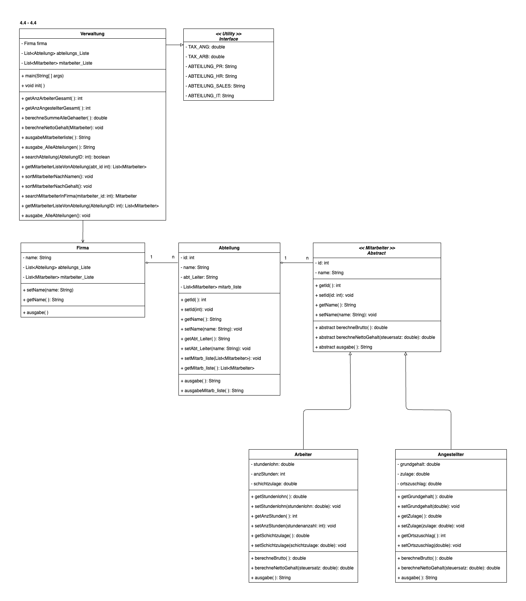

# Firma Version 4.3 - 4.4
Dieses Repo enthält die Java-Lösung zum ersten Teil von Version 4 des Projekts "Firma".

Die Main-Datei ist `Verwaltung.java` allerdings befinden sich alle Tests in der Datei `VerwaltungTest.java` (insgesamt zwanzig JUnit-Tests).

## Klassendiagramm

Die Originaldateien des Klassendiagramms findet man hier: https://github.com/mbalabanov/ClassDiagramFirmaV4_1-4_4
